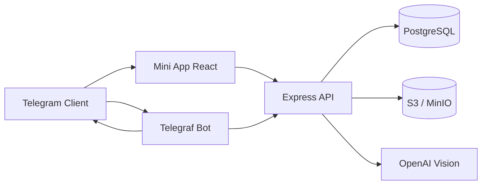
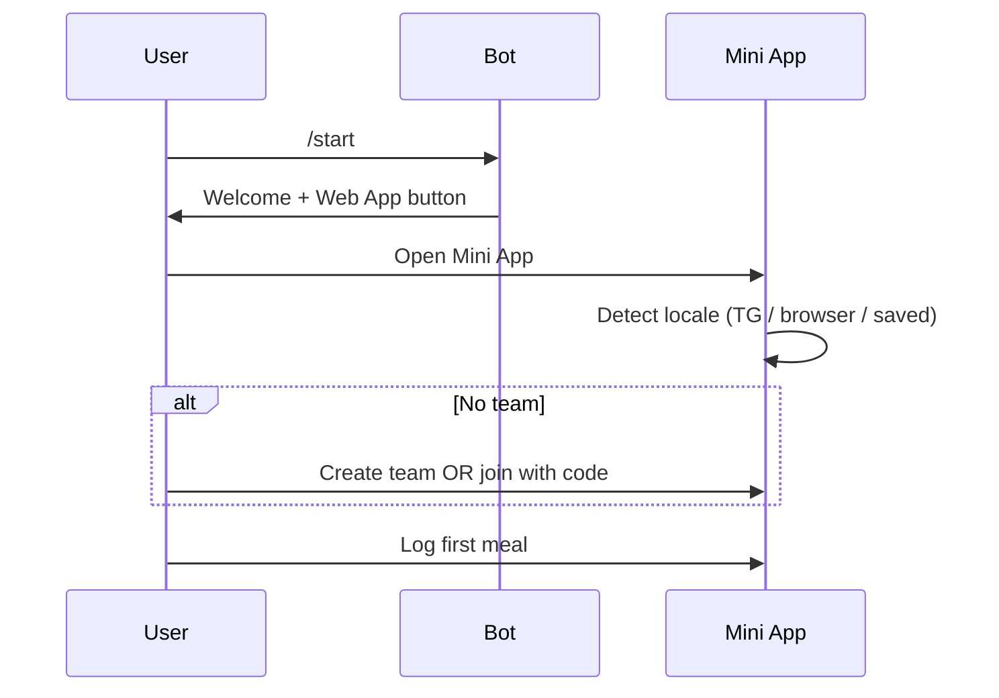

# NutriCrew — Product & API Specification

**Version:** 0.2.0 · **Locales:** EN / RU · **Platform:** Telegram Bot + Mini App

---

## 1. Product overview

### 1.1 Vision

NutriCrew turns calorie tracking into a **social team game**: photo → AI analysis → points for the crew → weekly battles between friend/colleague groups.

**USP:** Like Duolingo for nutrition — habit is driven by team pressure and competition, not willpower alone.

### 1.2 Target audience

| Segment | Description |
|---------|-------------|
| Young professionals (25–35) | Office / remote workers with irregular eating habits |
| Friend & colleague groups | Corporate wellness, sports teams, weight-loss groups |
| Competition-minded users | Strava, Duolingo, MyFitnessPal users |
| Telegram-native users | Mini App users, group chat participants |

### 1.3 Engagement levels

1. **Track** — log meals, see calories and points  
2. **Team** — join a crew, shared weekly goals  
3. **Battle** — leaderboard, Stars prize pool, Premium badge  

---

## 2. System architecture



| Component | Stack |
|-----------|-------|
| Bot | Telegraf, polling / webhook |
| API | Express, JSON |
| Mini App | React, Vite, react-i18next |
| Database | PostgreSQL, Prisma ORM |
| Photos | AWS S3–compatible storage |
| AI | OpenAI `gpt-4o-mini` (optional) |
| Payments | Telegram Stars (`XTR`) |

---

## 3. Authentication

All Mini App API calls (except `/health`) require Telegram **Web App init data**.

| Header | Value |
|--------|-------|
| `X-Telegram-Init-Data` | Raw `window.Telegram.WebApp.initData` string |

Validation:

1. HMAC-SHA256 with bot token (`WebAppData` secret)  
2. `auth_date` not older than 24 hours  
3. User upserted into `users` on first request  

Bot auth: native Telegram user context (`ctx.from`).

---

## 4. User flows

### 4.1 Onboarding



**Deep link:** `t.me/{bot}?start=join_{INVITE_CODE}` — auto-join on `/start`.

### 4.2 Meal logging (3-second loop)

1. User takes/selects photo  
2. `POST /api/meals/analyze` → AI returns description, calories, protein  
3. User edits values if needed  
4. `POST /api/meals` → points, streak update, team score, S3 upload, teammate notification  

### 4.3 Weekly battle

- ISO week key format: `YYYY-Www` (e.g. `2026-W22`)  
- Team scores accumulate in `weekly_team_scores`  
- Monday 00:05 UTC: results, Stars distribution, goal rotation  
- Leaderboard: top 20 teams per current week  

### 4.4 Stars & prizes

1. Team member funds pool via Telegram Stars invoice  
2. Pool tracked per `(team_id, week_key)`  
3. Winning team (rank #1) splits **80%** of pool among members who logged ≥1 meal that week  
4. Stars credited to `users.star_balance` + `prize_awards` record  

### 4.5 Premium team

- One-time Stars invoice (default **99 ⭐**, **30 days**)  
- Sets `teams.is_premium = true`, `premium_until`  
- Premium badge in Mini App  

---

## 5. Game mechanics

### 5.1 Meal points

```
basePoints = max(5, round(calories / 10) + round(protein / 5))
personalPoints = round(basePoints × streakMultiplier)
teamPoints = round(basePoints × streakMultiplier × teamMultiplier)
```

### 5.2 Streak multiplier

| Streak (days) | Multiplier |
|---------------|------------|
| 1–2 | ×1.00 |
| 3–6 | ×1.15 |
| 7–13 | ×1.30 |
| 14+ | ×1.50 |

**Rules:**

- First log of the day extends streak if yesterday was logged; otherwise streak resets to 1  
- Missing a full day (cron at 00:10 UTC) resets streak to 0 and notifies teammates  

### 5.3 Team multiplier

Based on share of members who logged ≥1 meal **today**:

| Logged ratio | Multiplier |
|--------------|------------|
| 100% | ×1.50 |
| ≥75% | ×1.25 |
| ≥50% | ×1.10 |
| <50% | ×1.00 |

### 5.4 Weekly goal rotation

Cycles every Monday after results:

| Type | Default target | Unit |
|------|----------------|------|
| `points` | 1000 | pts |
| `protein` | 500 | g |
| `calories` | 12000 | kcal |

---

## 6. Mini App screens

| Route | Screen | Description |
|-------|--------|-------------|
| `/` | Home | Streak, multipliers, today points, team onboarding |
| `/log` | Log meal | Photo → AI → form → submit |
| `/team` | Team | Members, weekly goal, invite code, Premium badge |
| `/leaderboard` | Rank | Weekly top teams |
| `/prizes` | Prizes | Star balance, fund pool, Premium, win history |

**i18n:** `miniapp/src/locales/en.json`, `ru.json`. Language switcher syncs via `PATCH /api/me/locale`.

---

## 7. Bot commands

| Command | Description |
|---------|-------------|
| `/start` | Welcome; handles `start=join_CODE` |
| `/help` | Command list |
| `/create {name}` | Create team, get invite code |
| `/join {code}` | Join team |
| `/team` | Team stats & invite code |
| `/stars` | Star balance & pool summary |
| `/lang en` \| `/lang ru` | Bot message language |

**Payments:** `pre_checkout_query` → approve; `successful_payment` → credit pool or activate Premium.

---

## 8. REST API reference

Base URL: `{API_HOST}/api`

### 8.1 Public

#### `GET /health`

```json
{ "ok": true, "service": "nutricrew-api", "db": true }
```

### 8.2 User

#### `GET /me`

Returns profile, streak, team multipliers, today points, star balance.

#### `PATCH /me/locale`

```json
{ "locale": "en" | "ru" }
```

### 8.3 Teams

#### `POST /teams/create`

```json
{ "name": "Protein Squad" }
```

Response: `{ "id", "name", "inviteCode" }`  
Errors: `400 ALREADY_IN_TEAM`, `400 name required`

#### `POST /teams/join`

```json
{ "code": "ABC12345" }
```

Errors: `404 TEAM_NOT_FOUND`

#### `GET /team`

Requires active team. Returns members, weekly goal progress, rank, `isPremium`.

Errors: `404 NO_TEAM`

### 8.4 Meals

#### `POST /meals/analyze`

```json
{ "imageBase64": "data:image/jpeg;base64,..." }
```

Response:

```json
{
  "description": "Oatmeal and eggs",
  "calories": 420,
  "protein": 28,
  "confidence": 0.85,
  "source": "openai" | "fallback"
}
```

#### `POST /meals`

```json
{
  "description": "Oatmeal and eggs",
  "calories": 420,
  "protein": 28,
  "imageBase64": "..."
}
```

Response: `{ "id", "points", "teamPoints", "streak", "photoUrl", "message" }`

### 8.5 Leaderboard

#### `GET /leaderboard`

```json
{
  "week": "2026-W22",
  "teams": [{ "rank": 1, "name": "...", "points": 1240 }]
}
```

### 8.6 Prizes (Telegram Stars)

#### `GET /prizes`

```json
{
  "starBalance": 25,
  "pool": {
    "weekKey": "2026-W22",
    "starsTotal": 100,
    "starsDistributed": 0,
    "starsAvailable": 100
  },
  "teamPremium": false,
  "premiumPrice": 99,
  "awards": [{ "weekKey": "2026-W21", "stars": 12, "at": "..." }]
}
```

#### `POST /prizes/fund-invoice`

```json
{ "stars": 50 }
```

Response: `{ "invoiceLink": "https://t.me/..." }` — open with `Telegram.WebApp.openInvoice`.

#### `POST /prizes/premium-invoice`

Response: `{ "invoiceLink": "..." }`

---

## 9. Notifications (push via bot)

| Trigger | Message (EN example) |
|---------|----------------------|
| Teammate logs meal | `🍽 Alex logged a meal (+42 pts) — Protein Squad` |
| Morning (cron) | `☀️ Your crew is waiting — log breakfast...` |
| Evening nudge | `⏰ You're behind Leader by 12 points...` |
| Weekly results | `🏆 Week 2026-W22 results...` |
| Prize win | `🏆 +12 Stars for winning with Protein Squad!` |
| Streak broken | `⚠️ Alex's streak broke — team multiplier dropped` |

Locale follows `users.locale`.

---

## 10. Scheduled jobs (UTC)

| Cron | Job |
|------|-----|
| `5 0 * * 1` | Weekly reset: distribute Stars, notify results, rotate goals |
| `10 0 * * *` | Reset broken streaks, notify team |
| `0 {REMINDER_HOUR_UTC} * * *` | Morning reminders |
| `0 18 * * *` | Evening nudges |

Disable: `CRON_ENABLED=false`.

---

## 11. External services

| Service | Env vars | Required |
|---------|----------|----------|
| PostgreSQL | `DATABASE_URL` | Yes |
| Telegram Bot | `BOT_TOKEN` | Yes |
| OpenAI Vision | `OPENAI_API_KEY` | No (fallback estimates) |
| S3 / MinIO | `S3_*` | No (`S3_ENABLED=false`) |

---

## 12. Error codes

| Code | HTTP | Meaning |
|------|------|---------|
| `NO_TEAM` | 404 | User not in a team |
| `TEAM_NOT_FOUND` | 404 | Invalid invite code |
| `ALREADY_IN_TEAM` | 400 | One team per user (MVP) |
| `Invalid init data` | 401 | Bad or expired Telegram auth |
| `imageBase64 required` | 400 | Missing photo for analyze |

---

## 13. Non-functional requirements

| Area | Requirement |
|------|-------------|
| Latency | Meal analyze + log target < 5 s (excl. AI cold start) |
| i18n | All user-facing Mini App strings in EN + RU |
| Security | Validate all init data; never trust client calories without review |
| Storage | Meal photos in private S3 bucket; public read via configured URL (dev: MinIO anonymous) |
| Payments | Idempotent payment handling via unique `payload` |

---

## 14. MVP constraints & roadmap

**MVP limits:**

- One team per user (no leave/switch)  
- Manual calorie correction after AI  
- Star balance in-app (no external withdrawal API)  
- English-first product copy; RU fully supported in UI  

**Roadmap:**

- [ ] Product database (RU + international foods)  
- [ ] Corporate admin dashboard  
- [ ] Anti-cheat (non-food photo detection)  
- [ ] Inline team results sharing in group chats  
- [ ] Streams / live team feed  

---

## 15. Related documents

- [Database schema (EN)](./DATABASE.md)  
- [Спецификация (RU)](../ru/SPEC.md)  
- [Схема БД (RU)](../ru/DATABASE.md)
