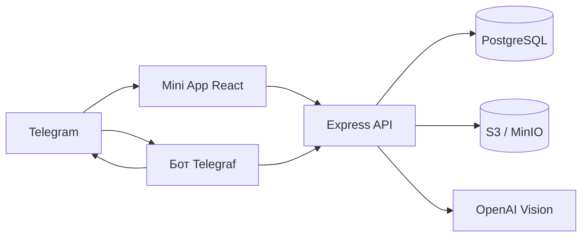
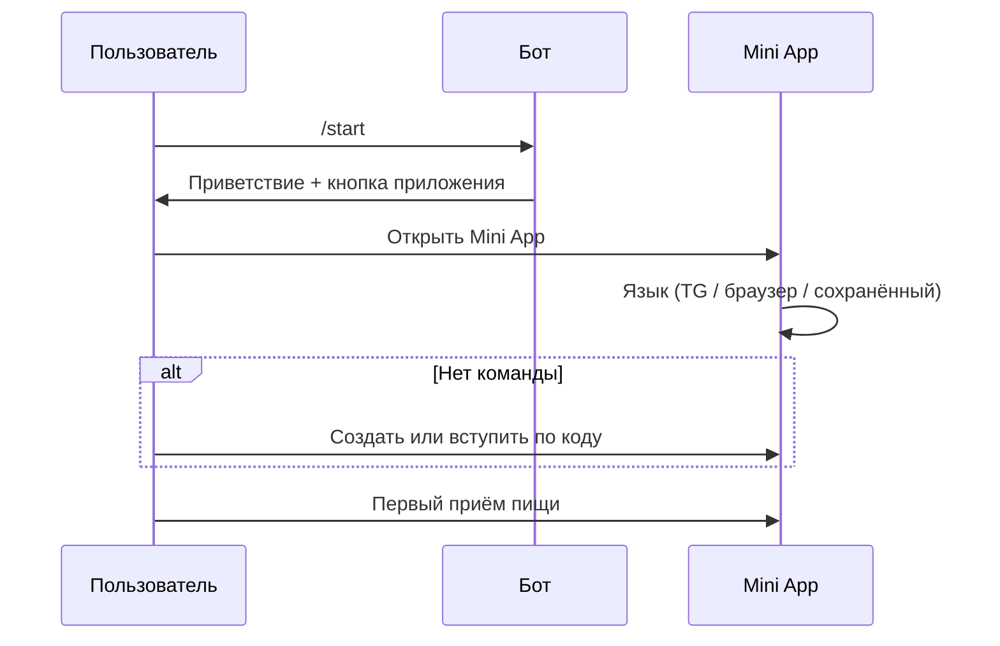

# NutriCrew — Спецификация продукта и API

**Версия:** 0.2.0 · **Языки:** EN / RU · **Платформа:** Telegram Bot + Mini App

---

## 1. Обзор продукта

### 1.1 Видение

NutriCrew превращает подсчёт калорий в **социальную командную игру**: фото → анализ ИИ → очки команде → еженедельные битвы между группами друзей и коллег.

**УТП:** Как Duolingo для питания — привычка формируется через командное давление и соревнование, а не силу воли.

### 1.2 Целевая аудитория

| Сегмент | Описание |
|---------|----------|
| Молодые профессионалы (25–35) | Офис / удалёнка, нерегулярное питание |
| Группы друзей и коллег | Корпоративный ЗОЖ, спортивные команды |
| Любители соревнований | Пользователи Strava, Duolingo, MyFitnessPal |
| Telegram-native | Mini App, групповые чаты |

### 1.3 Уровни вовлечённости

1. **Трекинг** — логирование еды, калории и очки  
2. **Команда** — crew, общие недельные цели  
3. **Битва** — рейтинг, призовой фонд Stars, Premium  

---

## 2. Архитектура



| Компонент | Стек |
|-----------|------|
| Бот | Telegraf, polling / webhook |
| API | Express, JSON |
| Mini App | React, Vite, react-i18next |
| БД | PostgreSQL, Prisma ORM |
| Фото | S3-совместимое хранилище |
| ИИ | OpenAI `gpt-4o-mini` (опционально) |
| Платежи | Telegram Stars (`XTR`) |

---

## 3. Аутентификация

Все запросы Mini App (кроме `/health`) требуют **init data** Telegram Web App.

| Заголовок | Значение |
|-----------|----------|
| `X-Telegram-Init-Data` | Строка `window.Telegram.WebApp.initData` |

Проверка:

1. HMAC-SHA256 с токеном бота (секрет `WebAppData`)  
2. `auth_date` не старше 24 часов  
3. Пользователь создаётся/обновляется в `users` при первом запросе  

Бот: контекст Telegram (`ctx.from`).

---

## 4. Пользовательские сценарии

### 4.1 Онбординг



**Deep link:** `t.me/{bot}?start=join_{КОД}` — автовступление при `/start`.

### 4.2 Логирование еды (~3 секунды)

1. Фото с камеры или галереи  
2. `POST /api/meals/analyze` → описание, калории, белок  
3. Правка пользователем  
4. `POST /api/meals` → очки, серия, счёт команды, S3, уведомление тиммейтам  

### 4.3 Недельная битва

- Ключ недели: `YYYY-Www` (например `2026-W22`)  
- Очки команды в `weekly_team_scores`  
- Понедельник 00:05 UTC: итоги, раздача Stars, смена цели  
- Рейтинг: топ-20 команд текущей недели  

### 4.4 Stars и призы

1. Участник пополняет фонд через инвойс Telegram Stars  
2. Фонд на пару `(team_id, week_key)`  
3. Команда-победитель (#1) делит **80%** фонда между участниками с ≥1 meal за неделю  
4. Stars на `users.star_balance` + запись в `prize_awards`  

### 4.5 Premium команда

- Разовый инвойс Stars (по умолчанию **99 ⭐**, **30 дней**)  
- `teams.is_premium = true`, `premium_until`  
- Бейдж Premium в Mini App  

---

## 5. Игровая механика

### 5.1 Очки за приём пищи

```
basePoints = max(5, round(калории / 10) + round(белок / 5))
личныеОчки = round(basePoints × множительСерии)
очкиКоманды = round(basePoints × множительСерии × множительКоманды)
```

### 5.2 Множитель серии

| Серия (дней) | Множитель |
|--------------|-----------|
| 1–2 | ×1.00 |
| 3–6 | ×1.15 |
| 7–13 | ×1.30 |
| 14+ | ×1.50 |

**Правила:**

- Первый лог за день продлевает серию, если вчера тоже был лог; иначе серия = 1  
- Пропуск дня (cron 00:10 UTC) сбрасывает серию в 0, уведомление команде  

### 5.3 Множитель команды

Доля участников с ≥1 meal **сегодня**:

| Доля | Множитель |
|------|-----------|
| 100% | ×1.50 |
| ≥75% | ×1.25 |
| ≥50% | ×1.10 |
| <50% | ×1.00 |

### 5.4 Ротация недельных целей

Каждый понедельник после итогов:

| Тип | Цель по умолчанию | Единица |
|-----|-------------------|---------|
| `points` | 1000 | очк. |
| `protein` | 500 | г |
| `calories` | 12000 | ккал |

---

## 6. Экраны Mini App

| Маршрут | Экран | Описание |
|---------|-------|----------|
| `/` | Главная | Серия, множители, очки за день, онбординг команды |
| `/log` | Еда | Фото → ИИ → форма → отправка |
| `/team` | Команда | Участники, цель недели, код, Premium |
| `/leaderboard` | Топ | Рейтинг команд |
| `/prizes` | Призы | Баланс Stars, фонд, Premium, история |

**i18n:** `miniapp/src/locales/en.json`, `ru.json`. Переключатель синхронизирует `PATCH /api/me/locale`.

---

## 7. Команды бота

| Команда | Описание |
|---------|----------|
| `/start` | Старт; `start=join_КОД` |
| `/help` | Список команд |
| `/create {имя}` | Создать команду |
| `/join {код}` | Вступить |
| `/team` | Статистика и код |
| `/stars` | Баланс и фонд |
| `/lang en` \| `/lang ru` | Язык сообщений бота |

**Платежи:** `pre_checkout_query` → подтверждение; `successful_payment` → фонд или Premium.

---

## 8. REST API

Базовый URL: `{API_HOST}/api`

### 8.1 Публичные

#### `GET /health`

```json
{ "ok": true, "service": "nutricrew-api", "db": true }
```

### 8.2 Пользователь

#### `GET /me`

Профиль, серия, множители, очки за сегодня, баланс Stars.

#### `PATCH /me/locale`

```json
{ "locale": "en" | "ru" }
```

### 8.3 Команды

#### `POST /teams/create`

```json
{ "name": "Protein Squad" }
```

Ошибки: `400 ALREADY_IN_TEAM`, `400 name required`

#### `POST /teams/join`

```json
{ "code": "ABC12345" }
```

Ошибки: `404 TEAM_NOT_FOUND`

#### `GET /team`

Участники, прогресс цели, место в рейтинге, `isPremium`.

Ошибки: `404 NO_TEAM`

### 8.4 Приёмы пищи

#### `POST /meals/analyze`

```json
{ "imageBase64": "data:image/jpeg;base64,..." }
```

Ответ: `description`, `calories`, `protein`, `confidence`, `source` (`openai` | `fallback`).

#### `POST /meals`

```json
{
  "description": "Овсянка и яйца",
  "calories": 420,
  "protein": 28,
  "imageBase64": "..."
}
```

Ответ: `id`, `points`, `teamPoints`, `streak`, `photoUrl`, `message`.

### 8.5 Рейтинг

#### `GET /leaderboard`

```json
{
  "week": "2026-W22",
  "teams": [{ "rank": 1, "name": "...", "points": 1240 }]
}
```

### 8.6 Призы (Telegram Stars)

#### `GET /prizes`

Баланс, фонд недели, Premium, история наград.

#### `POST /prizes/fund-invoice`

```json
{ "stars": 50 }
```

Ответ: `{ "invoiceLink": "..." }` — открыть через `Telegram.WebApp.openInvoice`.

#### `POST /prizes/premium-invoice`

Ответ: `{ "invoiceLink": "..." }`.

---

## 9. Уведомления (push через бота)

| Событие | Пример (RU) |
|---------|-------------|
| Тиммейт залогировал еду | `🍽 Алекс залогировал приём (+42 очк.) — Protein Squad` |
| Утро (cron) | `☀️ Команда ждёт — залогируй завтрак...` |
| Вечер | `⏰ Ты отстаёшь от Leader на 12 очков...` |
| Итоги недели | `🏆 Итоги недели 2026-W22...` |
| Выигрыш Stars | `🏆 +12 Stars за победу команды Protein Squad!` |
| Сброс серии | `⚠️ У Алекса сбилась серия — множитель команды снижен` |

Язык: `users.locale`.

---

## 10. Cron-задачи (UTC)

| Cron | Задача |
|------|--------|
| `5 0 * * 1` | Итоги недели, Stars, ротация целей |
| `10 0 * * *` | Сброс серий |
| `0 {REMINDER_HOUR_UTC} * * *` | Утренние напоминания |
| `0 18 * * *` | Вечерние пинки |

Отключение: `CRON_ENABLED=false`.

---

## 11. Внешние сервисы

| Сервис | Переменные | Обязательно |
|--------|------------|-------------|
| PostgreSQL | `DATABASE_URL` | Да |
| Telegram Bot | `BOT_TOKEN` | Да |
| OpenAI Vision | `OPENAI_API_KEY` | Нет |
| S3 / MinIO | `S3_*` | Нет |

---

## 12. Коды ошибок

| Код | HTTP | Значение |
|-----|------|----------|
| `NO_TEAM` | 404 | Пользователь не в команде |
| `TEAM_NOT_FOUND` | 404 | Неверный код |
| `ALREADY_IN_TEAM` | 400 | Одна команда на пользователя (MVP) |
| `Invalid init data` | 401 | Невалидная авторизация Telegram |
| `imageBase64 required` | 400 | Нет фото для анализа |

---

## 13. Нефункциональные требования

| Область | Требование |
|---------|------------|
| Задержка | Анализ + лог < 5 с |
| i18n | Все строки Mini App на EN и RU |
| Безопасность | Проверка init data; калории редактируются пользователем |
| Хранение | Фото в S3; URL по конфигу |
| Платежи | Идемпотентность по уникальному `payload` |

---

## 14. Ограничения MVP и roadmap

**MVP:**

- Одна команда на пользователя  
- Ручная правка после ИИ  
- Баланс Stars только в приложении  
- EN + RU в интерфейсе  

**Roadmap:**

- [ ] База продуктов (RU + международная)  
- [ ] Корпоративная админка  
- [ ] Античит (не-еда на фото)  
- [ ] Inline-шеринг результатов в чатах  
- [ ] Стримы / лента команды  

---

## 15. Связанные документы

- [Database schema (EN)](../en/DATABASE.md)  
- [Product spec (EN)](../en/SPEC.md)  
- [Схема БД (RU)](./DATABASE.md)
